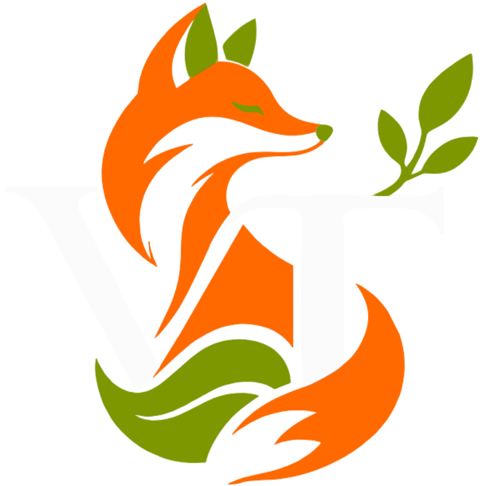

<p align="center">
  
</p>

<h1 align="center">🌎 Vida Terrestre</h1>

<p align="center">
  <strong>Educação, biodiversidade e conservação dos ecossistemas terrestres.</strong>
</p>

<p align="center">
Plataforma web educativa dedicada à pesquisa, divulgação e conscientização sobre a fauna, os habitats e a conservação dos ecossistemas terrestres brasileiros.
</p>

<p align="center">
  <a href="https://wellingtons-dias.github.io/vida-terrestre/">🌐 Acessar o projeto</a>
  ·
  <a href="#-sobre-o-projeto">Sobre</a>
  ·
  <a href="#-tecnologias">Tecnologias</a>
  ·
  <a href="#-equipe">Equipe</a>
</p>

---

## Sobre o projeto

O **Vida Terrestre** é uma plataforma web educativa desenvolvida como parte do **Projeto Integrador do curso de Desenvolvimento Web da Faculdade Senac Criciúma**.

O projeto foi desenvolvido com o objetivo de ampliar o acesso a informações sobre a biodiversidade brasileira por meio de uma experiência digital informativa, interativa e acessível.

A plataforma apresenta conteúdos relacionados à **fauna, habitats, biodiversidade e conservação ambiental**, com ênfase inicial nas espécies e nos ecossistemas brasileiros.

Além da finalidade educativa, o projeto busca promover a conscientização sobre a importância da preservação ambiental e da participação da sociedade na conservação da biodiversidade.

---

## Objetivos

O **Vida Terrestre** tem como objetivos:

* Promover a conscientização sobre a biodiversidade brasileira.
* Apresentar informações sobre espécies, habitats e ecossistemas.
* Incentivar a preservação dos ecossistemas terrestres.
* Facilitar o acesso a informações relacionadas ao meio ambiente.
* Estimular o interesse pela pesquisa e pelo conhecimento da fauna brasileira.
* Utilizar a tecnologia como instrumento de educação ambiental.
* Contribuir para a disseminação de conhecimentos relacionados ao desenvolvimento sustentável.

---

## ODS 15 — Vida Terrestre

O projeto está alinhado ao **Objetivo de Desenvolvimento Sustentável 15 (ODS 15)**, estabelecido pela **Organização das Nações Unidas (ONU)**.

A ODS 15 tem como foco:

> **Proteger, restaurar e promover o uso sustentável dos ecossistemas terrestres, gerir de forma sustentável as florestas, combater a desertificação, deter e reverter a degradação da terra e deter a perda de biodiversidade.**

O **Vida Terrestre** utiliza a tecnologia e a educação como instrumentos de apoio à conscientização ambiental, disponibilizando informações destinadas a ampliar o conhecimento sobre a biodiversidade e a importância de sua preservação.

---

## Funcionalidades

A plataforma foi desenvolvida com foco em uma experiência digital organizada, interativa e informativa.

Entre os principais recursos estão:

* **Exploração da fauna brasileira**
* **Sistema de pesquisa de espécies**
* **Informações sobre habitats**
* **Conteúdo visual e audiovisual**
* **Dados relacionados à biodiversidade**
* **Conteúdos relacionados à conservação ambiental**
* **Interface adaptada a diferentes dispositivos**
* **Identidade visual relacionada à natureza e à biodiversidade**

> 🚧 Novas funcionalidades e conteúdos ainda estão sendo desenvolvidos.

---

## Funcionalidades planejadas

Como parte do planejamento e da evolução da plataforma, estão previstas funcionalidades destinadas a ampliar os recursos informativos, interativos e educativos do projeto. Algumas propostas ainda se encontram em fase de análise ou dependem da evolução técnica da aplicação.

* **Notícias e acontecimentos atuais:** desenvolvimento de uma seção destinada à apresentação de notícias e informações recentes relacionadas ao meio ambiente e à biodiversidade.
* **Espaço colaborativo sobre a fauna:** possibilidade de criação de uma área na qual os usuários possam publicar fotografias e informações sobre animais, incluindo habitat, locais de observação, características e situação de conservação, além de interagir com outras publicações.
* **Sistema de inventário e cartas:** implementação de um sistema de gamificação baseado em cartas de espécies, inventário e pontuação, com o objetivo de incentivar a exploração dos conteúdos da plataforma.
* **Mapa interativo da fauna:** desenvolvimento de um mapa capaz de apresentar informações sobre espécies associadas à região selecionada pelo usuário.
* **Seção de espécies ameaçadas de extinção:** criação de uma área específica para apresentar espécies ameaçadas, sua distribuição, características e principais fatores de risco.

> Algumas dessas funcionalidades constituem propostas futuras e poderão ser implementadas de acordo com a viabilidade técnica e a evolução do projeto.

---

## Tecnologias

O projeto utiliza as seguintes tecnologias e ferramentas:

| Tecnologia       | Utilização                              |
| ---------------- | --------------------------------------- |
| **HTML5**        | Estrutura e organização das páginas     |
| **CSS3**         | Estilização, layout e identidade visual |
| **JavaScript**   | Interatividade e funcionalidades        |
| **Git**          | Controle de versão                      |
| **GitHub**       | Hospedagem e gerenciamento do código    |
| **GitHub Pages** | Publicação da aplicação web             |

---

## Identidade visual

A identidade visual do **Vida Terrestre** foi desenvolvida com o propósito de estabelecer uma relação visual com a natureza e a biodiversidade.

A interface utiliza elementos visuais inspirados em:

* Vegetação
* Fauna
* Ecossistemas
* Florestas
* Elementos naturais

O objetivo é apresentar o conteúdo ambiental de maneira visual, organizada e adequada à proposta educativa da plataforma.

---

## Estrutura do projeto

```text
Vida-Terrestre/
│
├── Assets/
│   ├── images/
│   └── vids/
│
├── CSS/
│   └── layout.css
│
├── JS/
│   └── main.js
│   └── slider.js
│
├── index.html
└── README.md
```

---

## Acesso ao projeto

O projeto está disponível para acesso por meio do **GitHub Pages**.

<p align="center">
  <a href="https://wellington-s-dias.github.io/vida-terrestre/">
    <strong>ACESSAR O PROJETO</strong>
  </a>
</p>

---

## Status do projeto

**Em desenvolvimento.**

O projeto encontra-se em desenvolvimento e poderá receber novas funcionalidades, conteúdos, aprimoramentos de interface e otimizações ao longo de sua evolução.

---

## Equipe

Projeto desenvolvido como atividade acadêmica do **curso de Desenvolvimento Web da Faculdade Senac Criciúma**.

### Integrantes

* **Augusto Rabelo Borges**
* **Davi Cypriano Búrigo**
* **Gustavo Fontana Colombo**
* **Wellington Sergio Dias**

---

## Contexto acadêmico

**Projeto Integrador — Desenvolvimento Web**

**Faculdade Senac Criciúma**

**Tema:** Biodiversidade e conservação dos ecossistemas terrestres

**ODS relacionada:** ODS 15 — Vida Terrestre

---

## Finalidade

Este projeto foi desenvolvido **para fins educacionais e acadêmicos**, como parte das atividades do curso de Desenvolvimento Web.

Seu desenvolvimento tem como finalidade aplicar conhecimentos relacionados a **HTML, CSS, JavaScript, controle de versão, publicação web e desenvolvimento de interfaces**, integrando tecnologia, desenvolvimento web e educação ambiental.

---

<p align="center">
  <strong>Vida Terrestre</strong>
  <br>
  Educação e conscientização para a conservação da biodiversidade.
</p>
